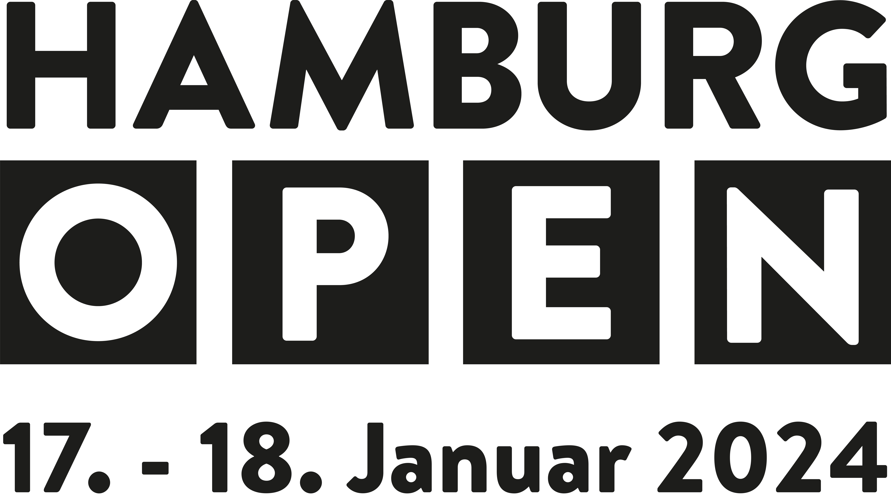
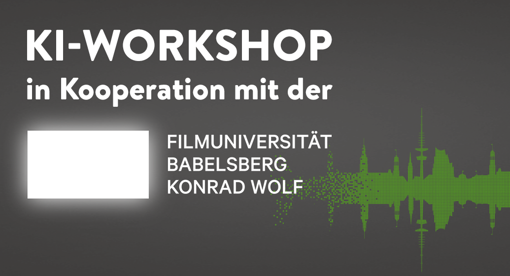

  
  

  
  

Mit dem Aufkommen von mächtigen KI Tools ergeben sich jenseits des Hypes auch viele interessante Anwendungen für die Broadcast- und Medientechnikbranche. Im Rahmen einer virtuellen Studio Umgebung, die —idealerweise in Echtzeit— computergenerierte multimediale Elemente mit realen Inhalten kombiniert, bieten KI Werkzeuge eine Verbesserung von bewährten Ansätzen bis hin zu ganz neuen kreativen Möglichkeiten. So können zum Beispiel mit einer Personen- und Objekterkennung Statistiken zum Live-Stream (Redezeiten, Produktinformationen, etc.) eingefügt werden, Masken effizient generiert werden, für eine Anonymisierung Gesichter mit real aussehenden künstlichen Gesichtern ersetzt und animiert werden oder aber auch vollständige Avatare nahtlos integriert werden.
  
Für erste Einblicke in KI-getriebene Entwicklungen für ein virtuelles Studio, beleuchtet der 1,5 stündige Workshop kurz algorithmischen Grundlagen und gibt einen Überblick über relevante KI Werkzeuge. Im praktischen Teil des Workshops haben die Teilnehmer:innen die Möglichkeit mit verschiedenen KI Tools selbst zu experimentieren und einen Anwendungsfall im Kontext eines virtuellen Studios zu erproben.

Mit
* [Anna Brauwers](https://www.annabrauwers.de/)
* [Prof. Dr. Lena Gieseke](https://www.filmuniversitaet.de/portrait/person/lena-gieseke)
* [Malte Hillebrand](https://maltehillebrand.de/)
* [Prof. Dr. Björn Stockleben](https://www.filmuniversitaet.de/portrait/person/bjoern-stockleben)

Agenda
1. [Einführung Machine Learning und Kontexte](./praesentationen/grundlagen/index.html)
2. Überblick KI Tools für Kreativschaffende
3. [Anwendungsfall *No-budget Production with AI Tools*](./anwendungsfaelle/tutorial1.md)
4. [Anwendungsfall *Auto-Director*](./anwendungsfaelle/tutorial1.md)
5. [Experimente KI-Tools](./uebersicht/index.md)
6. Reflexion und Diskussion
